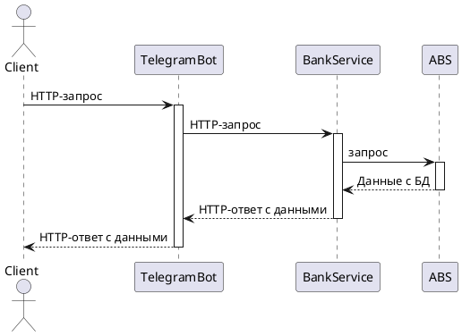

# GPB мини-банк.

# Middle-service.
Данная часть приложения будет отвечать за бизнес-логику, будет связующим звеном между telegram-bot'ом и Backend'ом.

# Полная архитектура приложения.

### Приложение разработанное в рамках GPB IT Factory Backend 2024 будет содержать:

1. Frontend часть, для взаимодействия с пользователем, которая будет реализована с помощью telegram-bot-api на java.
2. Middle часть, которая будет принимать, обрабатывать и передавать в Backend HTTP запрос.
3. Backend часть, которая будет хранить данные, обрабатывать транзакции(выступать в роли автоматизированной банковской системы).

## Принцип взаимодействия между компонентами:
Реализованно с помощью PlanUML:

# Стек технологий:
- Java 17
- Spring Boot 3.2.5
- PostgreSQL
- Gradle 8.4
    
